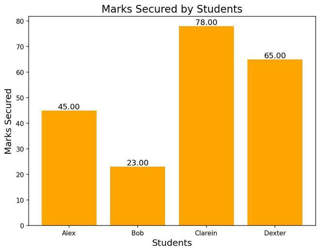
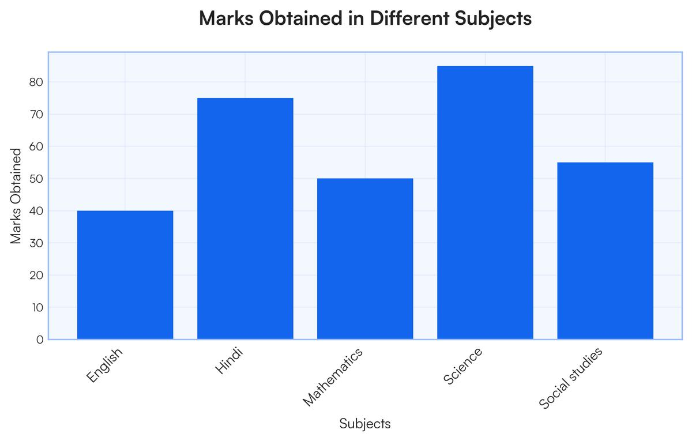

# Bar Plot

## Definition

A bar plot is a type of graph used to **compare values between different categories**.

It represents each category using a rectangular bar. The size or height of the bar shows the value of that category.

## Purpose

A bar plot is mainly used to:

* Compare different categories
* See which category has a higher or lower value
* Show differences between groups

## Example

For example, we can compare the number of students in different departments:

* AI → 40 students
* SE → 30 students
* CS → 50 students

A bar plot can clearly show the difference between these departments.

## When to Use a Bar Plot

Use a bar plot when:

* You want to compare categories
* The data consists of separate groups
* You want to see differences between values

## Important Point

A bar plot is mainly about **comparison between categories**, rather than showing a continuous trend over time.

## Example Plot

