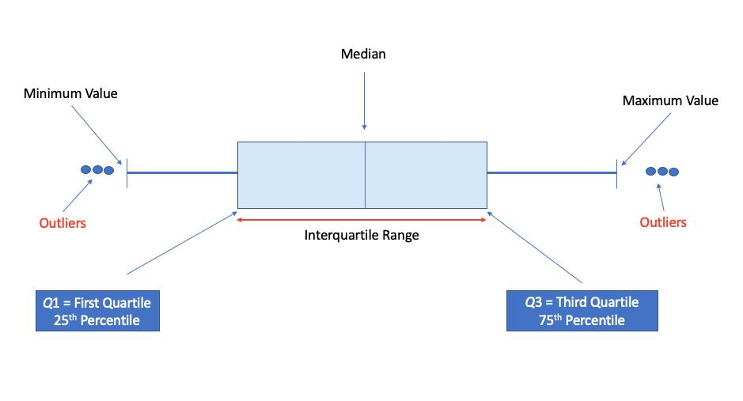
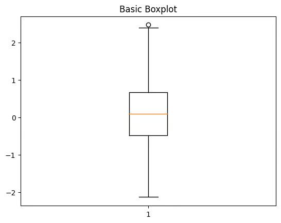
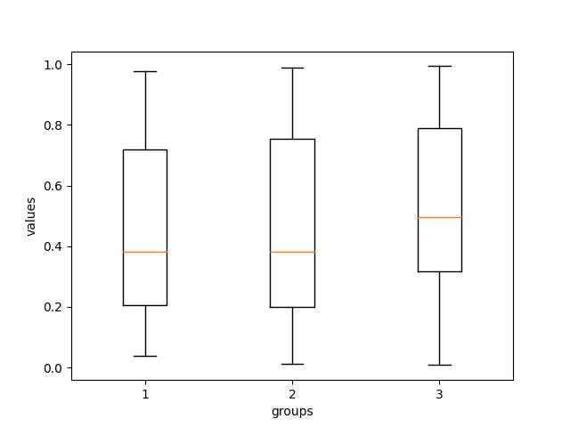

# Box Plot

## Definition

A box plot is a type of graph used to show the **distribution and spread of numerical data**.

It summarizes data using important values such as the minimum, Q1, median, Q3, and maximum. It can also help identify possible outliers.

## Purpose

A box plot is mainly used to:

* Understand the spread of data
* Find the median
* Understand the middle portion of the data
* Detect possible outliers
* Compare distributions between groups

## Important Values in a Box Plot

A box plot mainly shows these values:

1. **Minimum**
2. **Q1 (First Quartile)**
3. **Median**
4. **Q3 (Third Quartile)**
5. **Maximum**
6. **Possible Outliers**

### 1. Minimum

The **minimum** is the lowest normal value in the dataset.

### 2. Q1 — First Quartile

**Q1** is the value that separates approximately the **lowest 25% of the data** from the remaining data.

It is also called the **25th percentile**.

### 3. Median

The **median** is the middle value of the dataset.

It separates the data into approximately two equal parts:

* 50% of the data is below the median
* 50% of the data is above the median

It is also called the **50th percentile**.

### 4. Q3 — Third Quartile

**Q3** is the value that separates approximately the **highest 25% of the data** from the remaining data.

It is also called the **75th percentile**.

### 5. Maximum

The **maximum** is the highest normal value in the dataset.

### 6. Possible Outliers

An **outlier** is a value that is unusually far away from the rest of the data.

For example:

```python
marks = [45, 50, 55, 60, 65, 70, 75, 80, 85, 90, 150]
```

Here, `150` is much higher than the other marks, so it may be shown as a possible outlier.

## Box Plot Structure

```text
Minimum     Q1       Median       Q3      Maximum
   |         |          |           |         |
   ●─────────┌──────────│───────────┐─────────●
             │          │           │
             └──────────┴───────────┘
                                      ○
                                    Outlier
```

The **box** represents the middle 50% of the data, from **Q1 to Q3**.

The **median** is shown inside the box.

The lines extending from the box are called **whiskers**.

Possible outliers are shown separately from the whiskers.

## Example

For example, if we have the exam marks of students, a box plot can help us see:

* The middle value of the marks
* How spread out the marks are
* Where the middle 50% of the marks are located
* Whether some marks are unusually high or low

## When to Use a Box Plot

Use a box plot when:

* You want to understand the distribution of numerical data
* You want to compare distributions
* You want to identify possible outliers
* You want a summary of the spread of data

## In Matplotlib

A box plot can be created using:

```python
plt.boxplot(marks)
```

Matplotlib calculates the important values from the numerical data and displays them as a box plot.

## Important Point

A box plot gives a **compact summary of the distribution of data** and is especially useful for understanding spread, median, quartiles, and possible outliers.

## Example Plot






