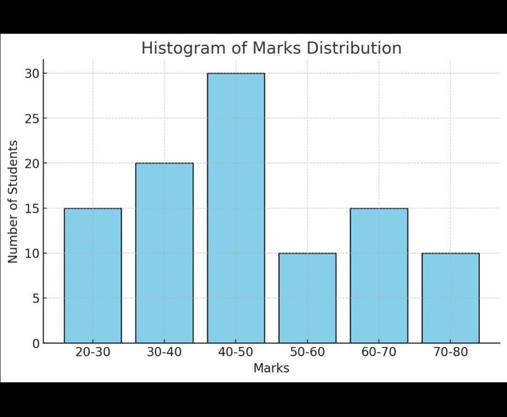
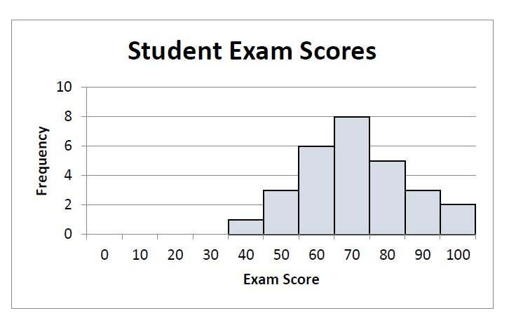
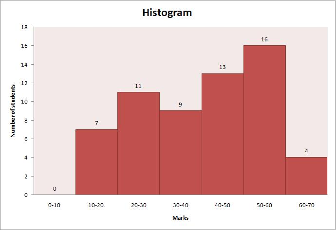

# Histogram

## Definition

A histogram is a type of graph used to show the **distribution of numerical data**.

It groups numerical values into ranges called **bins** and shows how many values fall within each range.

## Purpose

A histogram is mainly used to:

* Understand the distribution of data
* See where most values are located
* Identify the spread of data
* See whether data is concentrated or widely distributed

## Example

Suppose we have the marks of 100 students.

Instead of showing every mark separately, we can group them into ranges:

* 0–20
* 21–40
* 41–60
* 61–80
* 81–100

The histogram shows how many students fall into each range.

## When to Use a Histogram

Use a histogram when:

* You have numerical data
* You want to understand its distribution
* You want to see how frequently values occur within ranges

## Important Point

The main difference is that a histogram shows the **distribution of numerical data using ranges or bins**.

## Example Plot

