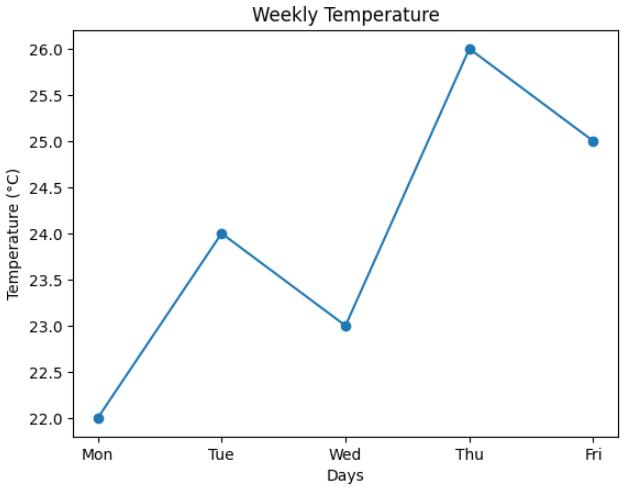
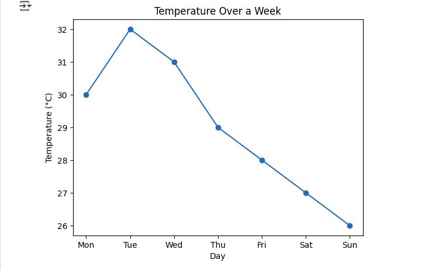
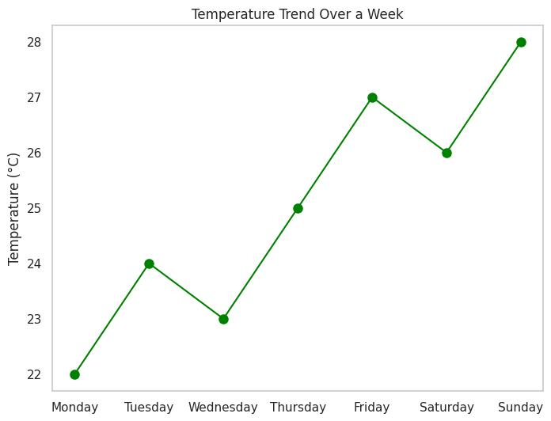

# Line Plot

## Definition

A line plot is a type of graph used to show **trends, changes, or movement over a period of time**.

It connects data points with lines so we can easily see how values increase, decrease, or change.

## Purpose

A line plot is mainly used to:

* Show changes over times
* Identify trends
* See increases and decreases
* Compare how values change from one point to another

## Example

For example, if we have the temperature of a city during different days:

* Monday → 25°C
* Tuesday → 27°C
* Wednesday → 26°C
* Thursday → 30°C

A line plot can show how the temperature changed from Monday to Thursday.

## When to Use a Line Plot

Use a line plot when:

* Data has an order
* You want to show a trend
* You want to show changes over time
* You want to see the movement of values from one point to another

## Important Point

A line plot is especially useful when the **order of the data points matters**, such as days, months, years, or other sequential values.

