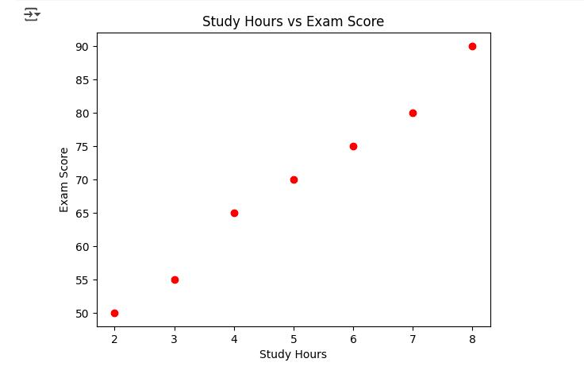
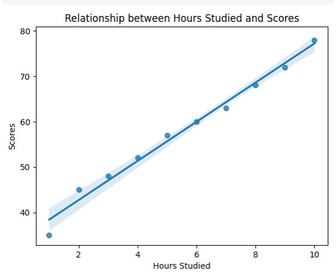
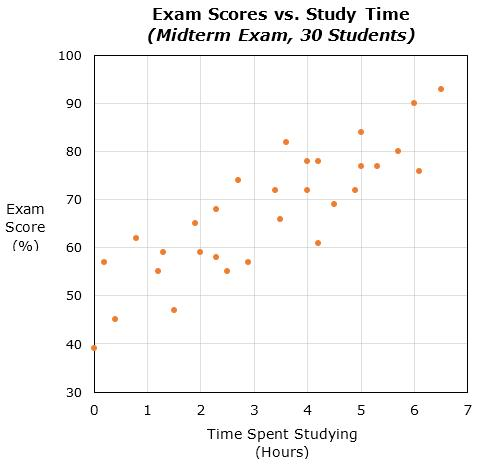

# Scatter Plot

## Definition

A scatter plot is a type of graph used to show the **relationship between two numerical variables**.

It represents individual data points on a graph using their values for two variables.

## Purpose

A scatter plot is mainly used to:

* Find relationships between two variables
* See patterns in data
* Identify whether two variables may be related
* Detect unusual data points

## Example

For example, we can compare:

* Hours studied
* Exam marks

Each student can be represented by one point.

If students who study more hours generally have higher marks, the points may show a pattern.

## When to Use a Scatter Plot

Use a scatter plot when:

* You have two numerical variables
* You want to investigate their relationship
* You want to find patterns or unusual observations

## Important Point

A scatter plot shows **individual observations as points** rather than connecting them with lines.

## Example Plot

